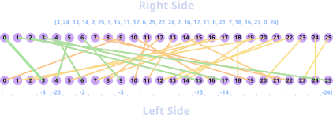
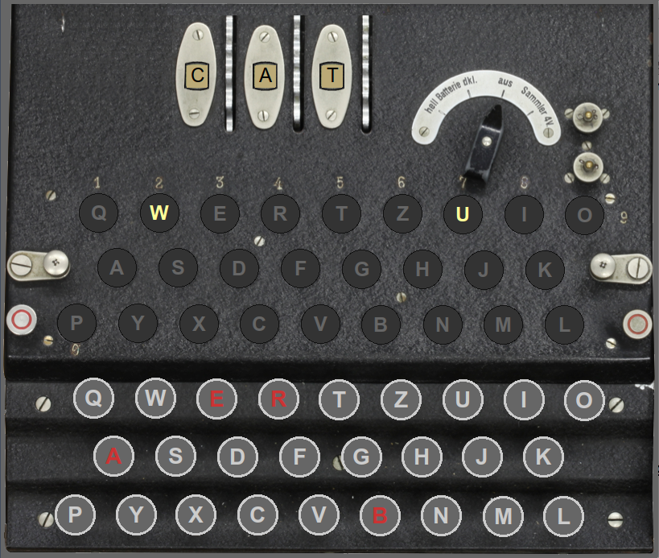

## Understanding the Rotors
- In our experience, one of the most difficult parts of the Enigma project is understanding how we represent the internal wiring in each rotor.
  - This semester, we are representing the internal wiring as a list of offsets, where each offset represents how far from the current contact the wire exits at
- The next few slides attempt to visualize and animate these concepts to help convey a better understanding
    - You need to understand how the machine works before you can write code to simulate that behavior
    - Ask questions! The better you can understand what is happening here, the easier it will be to write the necessary code


## Visualizing Enigma's Rotors {data-state="RotorDemo"}
<div id="RotorDemo">
<canvas contenteditable="true" width="1485" height="810" style="border: none; overflow: hidden; outline-width: 0px; width: 1485px; height: 810px;"></canvas>
</div>
<td style="text-align:center;">
    <table class="CTControlStrip">
        <tbody style="border:none;">
            <tr>
                <td>
                    
                </td>
                <td>
                    
                </td>
            </tr>
        </tbody>
    </table>
</td>

## Problem 1 Questions {data-state="RotorQuestions"}
<table>
<tbody style="border:none;">
<tr>
<td style="vertical-align:top; width:1400px;">
<ul>
<li>Using the rotor diagram at the right, answer
the following questions:

<ul>
<li>With this progress, where does a signal go starting at position 1
(<span class="hb">B</span>) on the right?

<p class="fragment" id="RotorQuestion1" data-fragment-index=1
>Answer: 10 (<span class="hb">K</span>)</p></li>

<li class="fragment" data-fragment-index=1
>Once the rotor advances to progress 1, where does a signal starting at position 9 (<span class="hb">J</span>) go?

<p class="fragment" id="RotorQuestion2" data-fragment-index=2
>Answer: 12 (<span class="hb">M</span>)</p></li>

<li class="fragment" data-fragment-index=2
>When the rotor advances to progress 4, where does a signal from position 11 (<span class="hb">L</span>) go?

<p class="fragment" data-fragment-index=3 id="RotorQuestion3" 
>Answer: 29 % 26 = 3 (<span class="hb">D</span>)</p></li>
</ul></li>

</ul>
</td>
<td style="vertical-align:top; width:300px;">
<div id="RotorQuestions" style="margin:0px;"></div>
</td>
</tr>
</tbody>
</table>


## Problem 2
- Letters-substitution ciphers like those implemented by each rotor require the sender and receiver to use different keys: one to encrypt the message and one to decrypt it
- Put differently, each incoming value follows a different wire depending on what direction it approaches from.
- As such, it is necessary to be able to compute a list of reversed wiring offsets for signals traveling the other direction.

## Problem 2 Visually



## Problem 2 Solution
- One possible solution with some tests might look like:
  ```{.mypython style='max-height: 800px; font-size: .7em'}
  
  def invert_wiring_offsets(r2l_offsets):
      """Inverts a list of wiring offsets for a rotor.
      Args:
          r2l_offsets (list[int]): the 26 element list of offsets for each contact
      Returns:
          (list[int]): the corresponding 26-element reverse wiring offsets list
      """
      rev_offsets = [0] * 26
      for i in range(26):
          # Negative offsets would be fine:
          rev_offsets[i] = -r2l_offsets[i]
          # But if you want positive:
          rev_offsets[i] = -r2l_offsets[i] % 26
      return rev_offsets
  
  # Unit test
  
  def test_invert_wiring_offsets():
      """Tests several R2L and resulting L2R wiring offset lists"""
      assert invert_wiring_offsets(list(range(26))) == list(range(26))
      wiring_offsets = [3,24,13,14,2,25,3,15,11,17,6,25,22,24,7,16,17,11,0,21,7,18,16,23,0,24]
      rev_wiring_offsets = [23,2,13,12,24,1,23,11,15,9,20,1,4,2,19,10,9,15,0,5,19,8,10,3,0,2]
      assert invert_key(en_key) == de_key
      assert invert_key(de_key) == en_key
  
  # Startup code
  
  if __name__ == "__main__":
      test_invert_wiring_offsets()
  ```

## Problem 3
- The Enigma Project follows the MCV Pattern
- The _View_ and the _Controller_ are both provided, and you add code to the _Model_
- The view and the controller need ways to "talk" to the model, which are provided with particularly named methods
- For changes you make in your model to show up at all in the graphics, you need to make sure you implement or alter those methods as necessary!

## Bearcat Enigma
::::::cols
::::col
- Add code to:
  - `is_key_pressed`
  - `is_lamp_on`
  - and `get_rotor_letter`
  so that the image to the right is replicated on your screen
- Note that you may need to click any key initially to cause an update to happen.
::::

::::col


::::
::::::

## Possible Solution
```{.mypython style='font-size:.7em; max-height:800px'}
def is_key_down(self, letter):
    """Checks if a particular key is down

    Args:
        letter (str): the letter of the key to check
    Returns:
        (bool): true if the key is down
    """
    if letter in "BEAR":
        return True
    else:
        return False

def is_lamp_on(self, letter):
    """Checks if a particular lamp is on

    Args:
        letter (str): the letter of the lamp to check
    Returns:
        (bool): true if the lamp is on
    """
    if letter in "WU":
        return True
    else:
        return False

def get_rotor_letter(self, index):
    """Gets the letter corresponding to a given rotor's current offset

    Args:
        index (int): the index of the rotor to query (0 for slow, 2 for fast)
    Returns:
        (str): the letter corresponding to the desired rotor's offset
    """
    return "CAT"[index]
```
