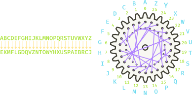
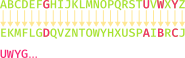

## Understanding the Rotors
- In our experience, one of the most difficult parts of the Enigma assignment is understanding how the rotors implement the translation
  - Difficult to understand how a string of letters equates to internal wiring
  - Difficult to visualize because of translating the 3D rotors into 2D diagrams
  - Difficult to conceptualize because the rotors turn
- The next few slides attempt to visualize and animate these concepts to help convey a better understanding
    - You need to understand how the machine works before you can write code to simulate that behavior
    - Ask questions! The better you can understand what is happening here, the easier it will be to write the necessary code


## Permutation to Rotor
- Before understanding the rotors, it helps to understand how the permutation string you are given corresponds to a given rotor's internal wiring




## Visualizing Enigma's Rotors {data-state="RotorDemo"}
<div id="RotorDemo">
<canvas contenteditable="true" width="1485" height="810" style="border: none; overflow: hidden; outline-width: 0px; width: 1485px; height: 810px;"></canvas>
</div>
<td style="text-align:center;">
    <table class="CTControlStrip">
        <tbody style="border:none;">
            <tr>
                <td>
                    
                </td>
                <td>
                    
                </td>
            </tr>
        </tbody>
    </table>
</td>

## Problem 1 Questions {data-state="RotorQuestions"}
<table>
<tbody style="border:none;">
<tr>
<td style="vertical-align:top; width:1400px;">
<ul>
<li>Using the rotor diagram at the right, answer
the following questions:

<ul>
<li>With this offset, where does a signal go starting at position 1
(<span class="hb">B</span>) on the right?

<p class="fragment" id="RotorQuestion1" data-fragment-index=1
>Answer: 10 (<span class="hb">K</span>)</p></li>

<li class="fragment" data-fragment-index=1
>Once the rotor advances to offset 1, where does a signal starting at position 9 (<span class="hb">J</span>) go?

<p class="fragment" id="RotorQuestion2" data-fragment-index=2
>Answer: 12 (<span class="hb">M</span>)</p></li>

<li class="fragment" data-fragment-index=2
>When the rotor advances to offset 4, where does a signal from position 2 (<span class="hb">C</span>) go?

<p class="fragment" data-fragment-index=3 id="RotorQuestion3" 
>Answer: 25 (<span class="hb">Z</span>)</p></li>
</ul></li>

</ul>
</td>
<td style="vertical-align:top; width:300px;">
<div id="RotorQuestions" style="margin:0px;"></div>
</td>
</tr>
</tbody>
</table>


## Question 2
:::{.incremental style='font-size:1em'}
- The Enigma project guide suggests that getting the rotor transformations to work is easier if you implement a top-level (not in a class) `apply_permutation` function
- Requires 3 arguments:
  - `index`: The index of the letter being "input" into the rotor. So "A" would correspond to 0. B to 1, etc.
  - `permutation`: The permutation string that defines the internal wiring of the rotor.
  - `offset`: The current offset of the rotor. How many steps it has been rotated from its starting position.
:::


## A Pseudo Solution
:::{style='font-size:.9em'}
- With an understanding of how the previous problem was solved, this function should like and achieve the following:
  ```{.mypython style='font-size:.8em'}
  def apply_permutation(index, permutation, offset):
      |||Compute a new index by shifting the og index forward by the offset, |||
        |||wrapping if needed.|||
      |||Use that new index to look up the corresponding letter in the permutation|||
        |||string.|||
      |||Convert that letter to a number corresponding to its location in the alphabet.|||
      |||Shift this number back by the offset, wrapping if necessary.|||
      |||Return the resulting number, which is a new index|||
  ```

- Your task here is to:
  - Convert the above into Python code
  - Write a small test function to ensure it works correctly. You can use the same examples from the previous slide.
:::


## Solution: Problem 2
- One possible, though not the only, solution might look like this:

```{.mypython style='max-height:800px; font-size:.75em'}
def apply_permutation(index, permutation, offset):
    """
    Translates the index of a character by applying both a permutation
    and a cyclic offset.  The index argument is the position at which
    the process starts and the method returns the new index after
    applying both transformations.
    """
    shifted_idx = (index + offset) % 26
    wired_letter = permutation[shifted_idx]
    target_idx = ord(wired_letter) - ord("A")
    #target_idx = ALPHABET.find(wired_letter) can also work if imported
    return (target_idx - offset) % 26

# Unit test

def test_apply_permutation():
    ROTOR = "EKMFLGDQVZNTOWYHXUSPAIBRCJ"
    assert apply_permutation(0, ROTOR, 0) == 4
    assert apply_permutation(1, ROTOR, 0) == 10
    assert apply_permutation(9, ROTOR, 1) == 12
    assert apply_permutation(2, ROTOR, 4) == 25

# Startup code

if __name__ == "__main__":
    test_apply_permutation()
```

## Problem 3
- Letters-substitution ciphers require the sender and receiver to use different keys: one to encrypt the message and one to decrypt it
- Here you task is to write a function `invert_key` that takes an encryption key as an argument and returns the corresponding decryption key



## Problem 3 Solution
- One possible solution with some tests might look like:
  ```{.mypython style='max-height: 800px; font-size: .75em'}
  
  ALPHABET = "ABCDEFGHIJKLMNOPQRSTUVWXYZ"
  
  def invert_key(key):
      """Inverts a 26-letter key for a letter-substitution cipher.
      Args:
          key (str): the 26-letter encryption string
      Returns:
          (str): the corresponding 26-letter decryption string
      """
      newkey = ""
      for ch in ALPHABET:
          newkey += ALPHABET[key.find(ch)]
      return newkey
  
  # Unit test
  
  def test_invert_key():
      """Tests several encryption and resulting decryption strings"""
      assert invert_key(ALPHABET) == ALPHABET
      en_key = "QWERTYUIOPASDFGHJKLZXCVBNM"
      de_key = "KXVMCNOPHQRSZYIJADLEGWBUFT"
      assert invert_key(en_key) == de_key
      assert invert_key(de_key) == en_key
  
  # Startup code
  
  if __name__ == "__main__":
      test_invert_key()
  ```

## Problem 3 Trace {data-state="InvertKeyTrace"}
<table id="InvertKeyTable">
<tbody style="border:none;">
<tr><td><div id="InvertKeyTrace" style="margin:0px;"></div></td></tr>
<tr><td>
<div id="InvertKeyBanner" style="margin:0px; padding:0px;">Console</div>
</td></tr>
<tr><td><div id="InvertKeyConsole"></div></td></tr>
<tr>
<td style="text-align:center;">
<table class="CTControlStrip">
<tbody>
<tr>
<td>

</td>
<td>

</td>
</tr>
</tbody>
</table>
</td>
</tr>
</table>


